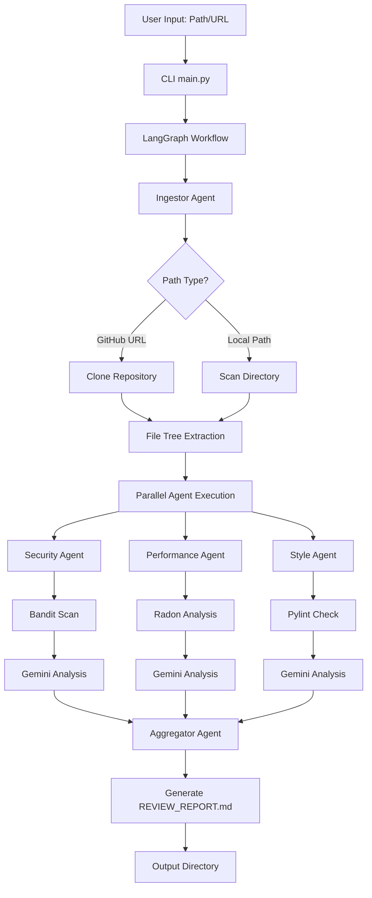
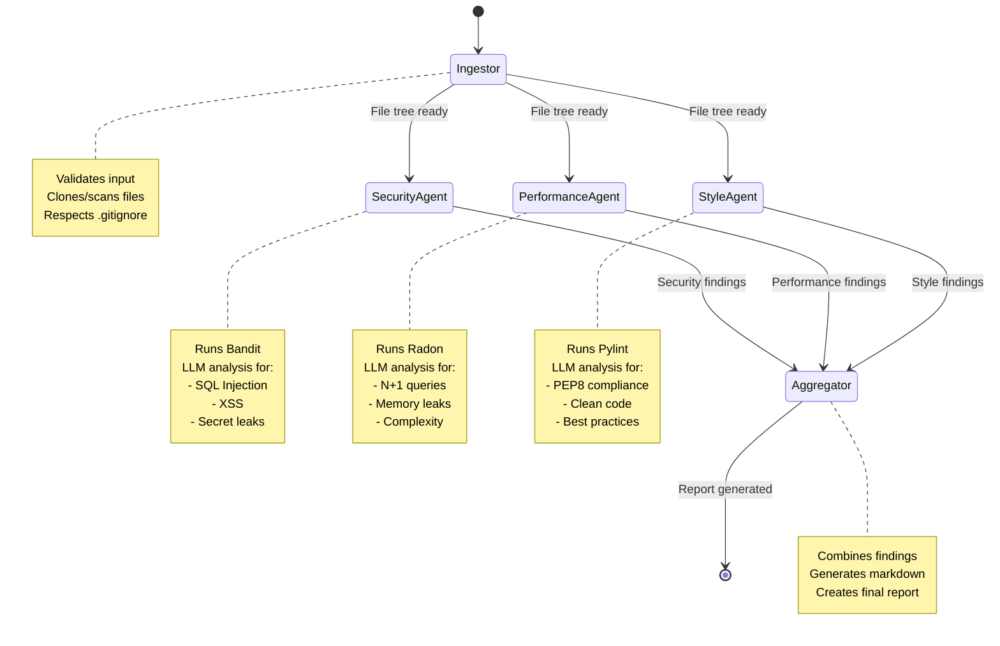

# System Architecture - Automated Code Review Agent

## 🏛️ High-Level Architecture



## 🔄 LangGraph Workflow Structure



## 📊 State Flow Through Agents

### Initial State (After Ingestor)
```python
{
    "input_path": "https://github.com/user/repo",
    "output_dir": "./code_reviews",
    "file_tree": [
        {"path": "main.py", "size": 1024, "type": "file"},
        {"path": "utils/", "size": 0, "type": "directory"},
        ...
    ],
    "total_files": 25,
}
```

### State After Parallel Agents
```python
{
    # ... previous state ...
    "security_findings": [
        {
            "file": "auth.py",
            "severity": "HIGH",
            "issue": "Hardcoded password",
            "line": 42,
            "recommendation": "Use environment variables"
        },
        ...
    ],
    "performance_findings": [
        {
            "file": "db.py",
            "issue": "N+1 query pattern",
            "line": 78,
            "recommendation": "Use select_related()"
        },
        ...
    ],
    "style_findings": [
        {
            "file": "helper.py",
            "issue": "Line too long (120 chars)",
            "line": 15,
            "recommendation": "Break into multiple lines"
        },
        ...
    ],
}
```

### Final State (After Aggregator)
```python
{
    # ... all previous state ...
    "final_report": "# Code Review Report\n\n...",
    "report_path": "./code_reviews/REVIEW_REPORT_2026-01-09.md",
}
```

## 🔧 Agent Implementation Details

### 1. Ingestor Agent
**Responsibilities:**
- Detect if input is URL or local path
- Clone GitHub repos to temp directory
- Scan local directories
- Parse .gitignore patterns
- Filter files by size/type
- Build file tree structure

**Technologies:**
- GitPython for cloning
- pathlib for file operations
- pathspec for .gitignore parsing

### 2. Security Agent
**Responsibilities:**
- Run Bandit security scanner
- Analyze static analysis results with Gemini
- Identify vulnerabilities:
  - SQL injection patterns
  - XSS vulnerabilities
  - Hardcoded secrets
  - Insecure cryptography
  - Authentication issues

**Prompt Strategy:**
- Expert security engineer persona
- Focus on OWASP Top 10
- Provide severity ratings
- Actionable remediation steps

### 3. Performance Agent
**Responsibilities:**
- Run Radon complexity analysis
- Analyze code patterns with Gemini
- Identify issues:
  - High cyclomatic complexity
  - N+1 query patterns
  - Memory leak indicators
  - Inefficient algorithms
  - Resource management

**Prompt Strategy:**
- Performance optimization expert
- Focus on scalability
- Big-O complexity analysis
- Database query optimization

### 4. Style Agent
**Responsibilities:**
- Run Pylint style checker
- Analyze code quality with Gemini
- Check for:
  - PEP8 compliance
  - Naming conventions
  - Code organization
  - Documentation quality
  - Clean code principles

**Prompt Strategy:**
- Clean code advocate persona
- Focus on maintainability
- Best practices enforcement
- Readability improvements

### 5. Aggregator Agent
**Responsibilities:**
- Collect all agent findings
- Organize by severity/category
- Generate structured markdown report
- Create executive summary
- Prioritize recommendations

**Report Sections:**
1. Executive Summary
2. Critical Issues (High severity)
3. Security Findings
4. Performance Findings
5. Style & Quality Findings
6. File-by-File Analysis
7. Recommendations by Priority

## 🛡️ Error Handling Strategy

### API Errors
```python
from tenacity import retry, stop_after_attempt, wait_exponential

@retry(
    stop=stop_after_attempt(3),
    wait=wait_exponential(multiplier=1, min=4, max=10)
)
def call_gemini_api(...):
    # API call logic
```

### File Processing Errors
- Skip files exceeding size limit (log warning)
- Handle binary files gracefully
- Catch and log encoding errors
- Continue processing remaining files

### Repository Access Errors
- Validate GitHub URL format
- Handle authentication failures
- Detect network issues
- Provide clear error messages

## 📈 Performance Optimizations

### 1. Parallel Processing
- Security, Performance, and Style agents run concurrently
- Reduces total processing time by ~66%

### 2. File Filtering
- Skip files based on .gitignore
- Filter by extension (focus on code files)
- Size limits prevent memory issues

### 3. Batch Processing
- Process files in batches if needed
- Checkpoint state for recovery
- Stream large outputs

### 4. Caching
- Cache static analysis results
- Reuse file tree structures
- Store temporary results

## 🔐 Security Considerations

### API Key Management
- Never commit .env files
- Use environment variables
- Validate key presence before execution

### Repository Cloning
- Clone to temporary directory
- Clean up after processing
- Validate repository URLs
- Avoid arbitrary code execution

### Output Sanitization
- Sanitize file paths in reports
- Avoid exposing secrets in output
- Validate user inputs

---

## 📝 LangGraph Node Definitions

### Node Function Signatures

```python
def ingestor_node(state: ReviewState) -> ReviewState:
    """Process input path and extract file tree"""
    pass

def security_node(state: ReviewState) -> ReviewState:
    """Run security analysis on file tree"""
    pass

def performance_node(state: ReviewState) -> ReviewState:
    """Run performance analysis on file tree"""
    pass

def style_node(state: ReviewState) -> ReviewState:
    """Run style analysis on file tree"""
    pass

def aggregator_node(state: ReviewState) -> ReviewState:
    """Compile all findings into final report"""
    pass
```

### Graph Construction

```python
from langgraph.graph import StateGraph

workflow = StateGraph(ReviewState)

# Add nodes
workflow.add_node("ingestor", ingestor_node)
workflow.add_node("security", security_node)
workflow.add_node("performance", performance_node)
workflow.add_node("style", style_node)
workflow.add_node("aggregator", aggregator_node)

# Define edges
workflow.set_entry_point("ingestor")

# Parallel execution after ingestion
workflow.add_edge("ingestor", "security")
workflow.add_edge("ingestor", "performance")
workflow.add_edge("ingestor", "style")

# Aggregation after all agents complete
workflow.add_edge("security", "aggregator")
workflow.add_edge("performance", "aggregator")
workflow.add_edge("style", "aggregator")

workflow.set_finish_point("aggregator")

graph = workflow.compile()
```

---

This architecture ensures:
✅ Scalability for large repositories
✅ Parallel processing for speed
✅ Robust error handling
✅ Extensibility for new agents
✅ Production-ready quality


This project is a Multi-Agent System (MAS) designed to automate the code review process. It works like an assembly line where specialized AI "agents" review your code for different qualities (Security, Performance, Style) and then collaborate to write a final report.

Here is a detailed breakdown of every aspect of the system:

1. High-Level Architecture
The system is built on LangGraph, a library for building stateful, multi-agent workflows. Unlike a simple script that runs top-to-bottom, this project uses a Graph structure where:

Nodes are the Agents (workers performing tasks).
Edges define the workflow (who passes work to whom).
State is a shared memory object that passes between agents, accumulating data.
2. The Workflow (Step-by-Step)
When you run python main.py --path <repo>, the following pipeline executes:

Phase 1: Ingestion (The Ingestor Agent)
Everything starts here. The Ingestor is responsible for "reading" the code.

Input Handling: It checks if your input is a local folder or a GitHub URL.
Cloning: If it's a URL, it uses GitPython to securely clone the repository to a temporary directory.
Filtering: It walks through the files but intelligently ignores anything in 
.gitignore
 or non-code files (images, binaries) to save processing power.
Output: It populates the "File Tree" in the shared state, a list of all files that need to be analyzed.
Phase 2: The Analysis Chain
Currently, the system runs three specialized agents in sequence for maximum stability. Each agent follows a Hybrid Analysis pattern: it runs a standard algorithmic tool first (for hard facts), then uses an LLM (Gemini or Ollama) to interpret the results and find nuanced issues.

🔒 Security Agent ("The Auditor")
Step 1 (Tool): Runs Bandit, a standard security linter. Bandit is great at finding known signatures (e.g., "This looks like an MD5 hash").
Step 2 (AI): It feeds the code and Bandit's findings to the LLM. The AI filters out false positives and looks for logic bugs that tools miss (e.g., "This function allows a user to elevate their own privileges").
Focus: SQL Injection, hardcoded secrets, XSS.
⚡ Performance Agent ("The Optimizer")
Step 1 (Tool): Runs Radon to calculate "Cyclomatic Complexity" (a mathematical score of how nested and complex your code is).
Step 2 (AI): The AI looks at complex functions to spot algorithmic inefficiencies. It can identify O(n²) nested loops, N+1 database queries, or redundant computations that a simple linter wouldn't catch.
✨ Style Agent ("The Craftsman")
Step 1 (Tool): Runs Pylint to check for PEP8 compliance (indentation, variable naming).
Step 2 (AI): The AI reviews the code for "Clean Code" principles. It checks for readability, proper function naming (e.g., "This function is named process() but acts like save_user()"), and SOLID design principles.
Phase 3: Aggregation (The Aggregator Agent)
Once all three analysis agents have added their findings to the shared state, the Aggregator takes over.

Synthesis: It reads through all findings (Security, Performance, Style).
Scoring: It calculates a "Health Score" for the codebase based on the severity and count of issues.
Reporting: It uses the LLM to write a cohesive Markdown Report. This isn't just a list of errors; it includes an Executive Summary, a file-by-file breakdown, and prioritized recommendations.
Cleanup: It deletes any temporary cloned repositories.
3. Key Technical Components
Shared State (ReviewState): This is the "brain" of the application. It looks like a dictionary that grows as the workflow progresses:
python
{
    "input_path": "...",
    "file_tree": ["main.py", "utils.py"],
    "security_findings": [{...}, {...}],    # Added by Security Agent
    "performance_findings": [{...}],         # Added by Performance Agent
    "style_findings": [{...}],               # Added by Style Agent
    "final_report": "..."                    # Created by Aggregator
}
The Hybrid Approach: This is the "secret sauce."
Why Tools? LLMs can hallucinate. Tools like Bandit provide ground truth (e.g., line 42 definitely has a specific vulnerability pattern).
Why LLMs? Tools are dumb. They can't understand context. The LLM acts as a senior engineer who reviews the tool's output and adds context-aware insights.
Orchestration:
The 
graph/workflow.py
 file defines the path. Currently, it forces a sequential path (Security -> Performance -> Style) to ensure that agents don't overwrite each other's state and to manage API rate limits effectively.
4. How to Use It
Configure: Set your GOOGLE_API_KEY in 
.env
.
Run:
bash
python main.py --path https://github.com/username/repo
(Or use a local path)
Result: A file named REVIEW_REPORT.md will be generated in code_reviews/, containing the full analysis.
Good
Bad
