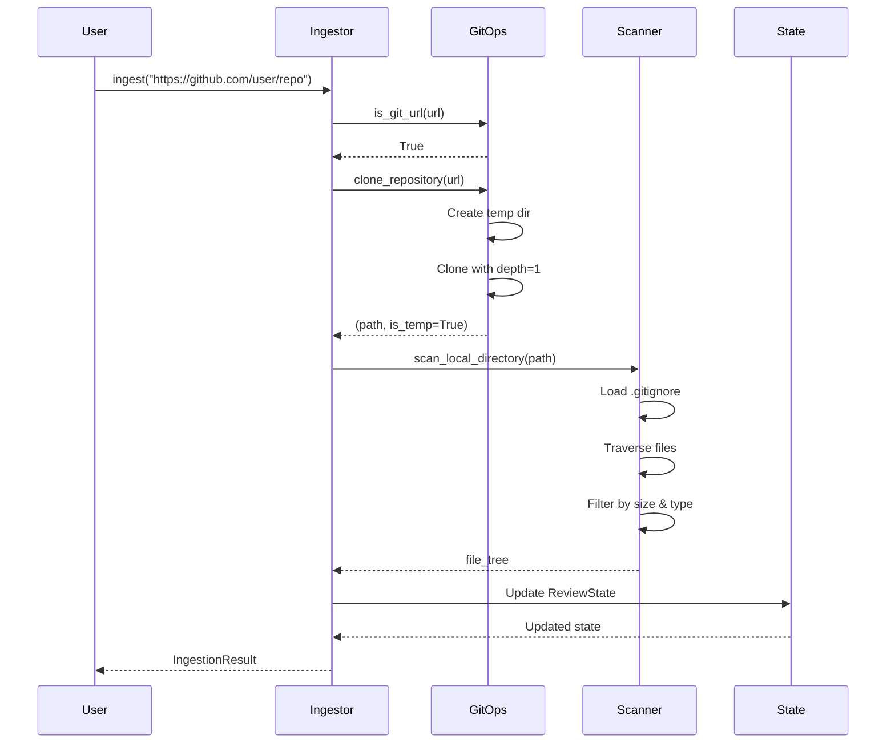
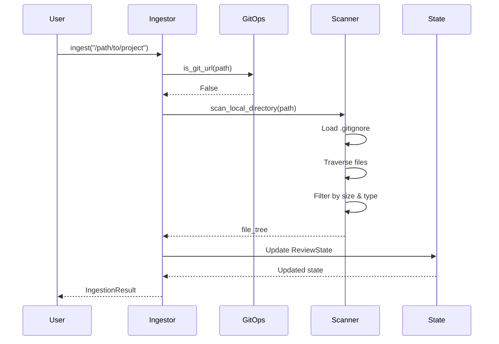

# Phase 2 Implementation Complete ✅

## 🎉 Ingestion System Fully Implemented

### Files Created

#### 1. **utils/logger.py** - Logging Infrastructure
- ✅ Colorized console output with `colorama`
- ✅ Optional file logging
- ✅ Configurable log levels via environment
- ✅ Custom formatter for better readability
- ✅ Cross-platform support (Windows color fix)

**Key Features:**
```python
logger = setup_logger(__name__)
logger.info("✅ Success message")  # Green
logger.warning("⚠️ Warning")       # Yellow
logger.error("❌ Error")           # Red
```

---

#### 2. **utils/git_ops.py** - Git Repository Operations
- ✅ Smart URL detection (GitHub, GitLab, Bitbucket)
- ✅ Repository cloning with shallow clone support
- ✅ Automatic temp directory management
- ✅ Repository cleanup with safety checks
- ✅ Repository name extraction

**Key Features:**
```python
# Detect if input is a Git URL
if is_git_url(path):
    # Clone with shallow clone (depth=1)
    repo_path, is_temp = clone_repository(url)
    
# Extract repo name
name = extract_repo_name("https://github.com/user/repo")  # "repo"

# Cleanup temp directories
cleanup_repository(repo_path)
```

**Supported URL Formats:**
- `https://github.com/user/repo`
- `git@github.com:user/repo.git`
- `https://gitlab.com/user/repo`
- `https://bitbucket.org/user/repo`

---

#### 3. **utils/file_scanner.py** - Directory Scanning
- ✅ Recursive directory traversal
- ✅ `.gitignore` pattern parsing and matching
- ✅ Default ignore patterns (Python, Node.js, builds, etc.)
- ✅ File size filtering (configurable via env)
- ✅ Code-only mode (filters by extension)
- ✅ Binary file detection and skipping
- ✅ Comprehensive file tree extraction

**Key Features:**
```python
# Scan directory with .gitignore support
result = scan_local_directory(
    directory_path="/path/to/project",
    max_size_mb=5.0,
    code_only=True
)

# Returns:
{
    'root_path': '/path/to/project',
    'files': [
        {
            'path': '/full/path/file.py',
            'relative_path': 'src/file.py',
            'name': 'file.py',
            'extension': '.py',
            'size_bytes': 1024,
            'size_mb': 0.001
        },
        ...
    ],
    'total_files': 42,
    'total_size_mb': 2.5,
    'extensions': {'.py': 30, '.js': 10, '.md': 2}
}
```

**Supported Code Extensions:**
`.py`, `.js`, `.jsx`, `.ts`, `.tsx`, `.java`, `.cpp`, `.c`, `.h`, `.cs`, `.go`, `.rb`, `.php`, `.swift`, `.kt`, `.rs`, `.scala`, `.sh`, `.sql`, `.html`, `.css`, `.json`, `.yaml`, `.xml`, `.md`

---

#### 4. **agents/ingestor.py** - Ingestor Agent
- ✅ Unified interface for Git and local sources
- ✅ Automatic source type detection
- ✅ Temp directory tracking and cleanup
- ✅ Comprehensive error handling
- ✅ LangGraph node factory function
- ✅ Detailed logging at each step

**Key Features:**
```python
# Create and use ingestor
ingestor = IngestorAgent(max_file_size_mb=5.0, code_only=True)

# Works with both URLs and local paths
result = ingestor.ingest("https://github.com/user/repo")
result = ingestor.ingest("/local/path/to/project")

# Returns IngestionResult:
{
    'success': True,
    'source_type': 'git' | 'local',
    'source_path': '...',
    'working_directory': '...',
    'file_tree': {...},
    'is_temp': True | False,
    'error': None
}

# Auto cleanup
ingestor.cleanup()
```

**LangGraph Integration:**
```python
# Use as a node in workflow
ingestor_node = create_ingestor_node()
workflow.add_node("ingestor", ingestor_node)
```

---

#### 5. **graph/state.py** - State Management
- ✅ Comprehensive `ReviewState` TypedDict
- ✅ Proper type annotations for all fields
- ✅ List accumulation with `operator.add` for parallel nodes
- ✅ Typed findings (Security, Performance, Style)
- ✅ Initial state factory function

**State Structure:**
```python
ReviewState = {
    # Input
    'input_path': str,
    'output_dir': str,
    
    # Ingestion Results
    'file_tree': Dict,
    'total_files': int,
    'working_directory': str,
    'source_type': str,
    'is_temp_directory': bool,
    
    # Agent Findings (accumulated)
    'security_findings': List[SecurityFinding],
    'performance_findings': List[PerformanceFinding],
    'style_findings': List[StyleFinding],
    
    # Processing
    'files_processed': List[str],
    'files_skipped': List[str],
    
    # Report
    'final_report': str,
    'report_path': str,
    
    # Errors
    'error': Optional[str],
    'warnings': List[str]
}
```

**Finding Types:**
- `SecurityFinding`: file, line, severity (HIGH/MEDIUM/LOW), issue_type, description, recommendation, confidence
- `PerformanceFinding`: file, line, issue_type, description, complexity_score, recommendation
- `StyleFinding`: file, line, issue_type, description, recommendation

---

## 🔄 How It All Works Together

### Flow Example: GitHub Repository



### Flow Example: Local Directory



---

## 🧪 Testing Recommendations

### Manual Testing

1. **Test Git Repository Ingestion:**
```bash
python -c "
from agents.ingestor import IngestorAgent
ingestor = IngestorAgent()
result = ingestor.ingest('https://github.com/pallets/flask')
print(f'Files found: {result[\"file_tree\"][\"total_files\"]}')
ingestor.cleanup()
"
```

2. **Test Local Directory Ingestion:**
```bash
python -c "
from agents.ingestor import IngestorAgent
ingestor = IngestorAgent()
result = ingestor.ingest('.')  # Current directory
print(f'Files found: {result[\"file_tree\"][\"total_files\"]}')
"
```

3. **Test File Scanner:**
```bash
python -c "
from utils.file_scanner import scan_local_directory
result = scan_local_directory('.')
print(f'Files: {result[\"total_files\"]}')
print(f'Size: {result[\"total_size_mb\"]}MB')
print(f'Extensions: {result[\"extensions\"]}')
"
```

---

## 📊 Phase 2 Metrics

### Code Statistics
- **Files Created:** 5
- **Lines of Code:** ~800+
- **Functions/Methods:** 25+
- **Classes:** 1 (IngestorAgent)
- **Type Definitions:** 4 TypedDicts

### Capabilities Delivered
✅ Git repository cloning (GitHub, GitLab, Bitbucket)  
✅ Local directory scanning  
✅ `.gitignore` pattern matching  
✅ File filtering (size, type, binary detection)  
✅ Comprehensive file tree extraction  
✅ Colored logging with file output  
✅ Temp directory management  
✅ LangGraph state integration  
✅ Error handling and recovery  

---

## 🎯 Next Steps: Phase 3

**Phase 3: LangGraph Workflow Implementation**

Files to create:
1. `graph/workflow.py` - LangGraph graph construction
   - Create StateGraph with ReviewState
   - Add all agent nodes
   - Define edges for parallel execution
   - Compile and return graph

2. `tools/bandit_tool.py` - Bandit security scanner wrapper

3. `tools/radon_tool.py` - Radon complexity analyzer wrapper

4. Update `graph/__init__.py` if needed

**Estimated complexity:** Medium  
**Estimated time:** 30-45 minutes

---

## 📝 Notes for Phase 3

### LangGraph Workflow Structure
```python
workflow = StateGraph(ReviewState)

# Add nodes
workflow.add_node("ingestor", ingestor_node)
workflow.add_node("security", security_node)
workflow.add_node("performance", performance_node)
workflow.add_node("style", style_node)
workflow.add_node("aggregator", aggregator_node)

# Sequential start
workflow.set_entry_point("ingestor")

# Parallel execution after ingestion
workflow.add_edge("ingestor", "security")
workflow.add_edge("ingestor", "performance")
workflow.add_edge("ingestor", "style")

# Wait for all parallel nodes, then aggregate
workflow.add_edge("security", "aggregator")
workflow.add_edge("performance", "aggregator")
workflow.add_edge("style", "aggregator")

workflow.set_finish_point("aggregator")
```

### Static Analysis Tools
- **Bandit:** Security vulnerability scanner for Python
- **Radon:** Code complexity analyzer (cyclomatic complexity, maintainability index)

These will be wrapped to return structured data for LLM analysis.

---

**Status:** Phase 2 Complete ✅  
**Ready for:** Phase 3 Implementation
