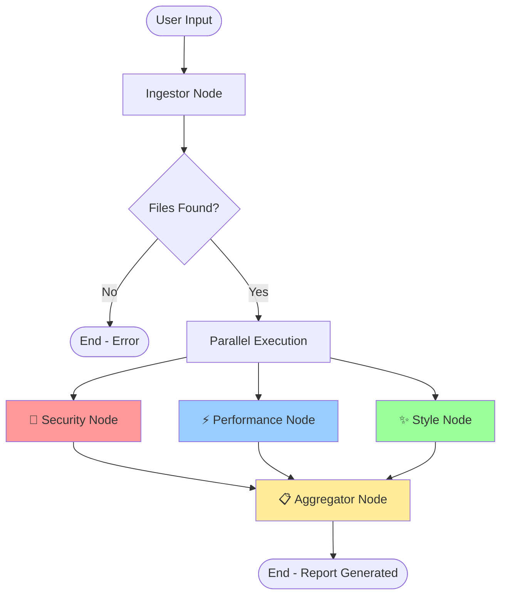
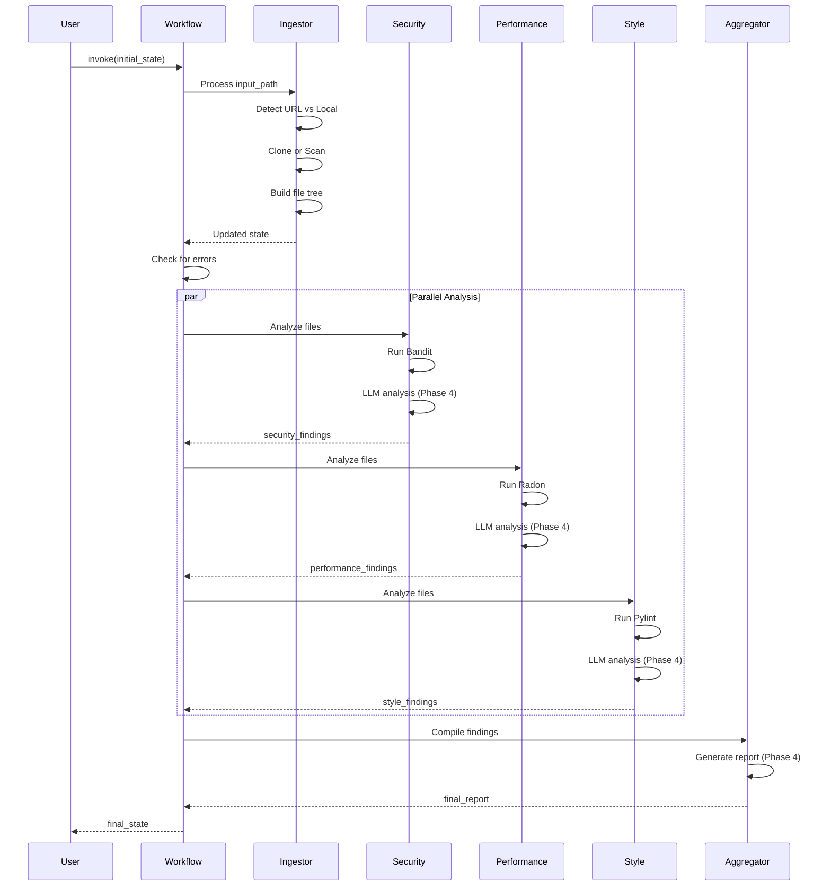

# Phase 3 Implementation Complete ✅

## 🎉 LangGraph Workflow & Static Analysis Tools Implemented

### Files Created

#### 1. **tools/bandit_tool.py** - Security Scanner Wrapper
- ✅ Bandit CLI integration with JSON output parsing
- ✅ Single file and directory scanning
- ✅ Severity filtering (LOW, MEDIUM, HIGH)
- ✅ Confidence level tracking
- ✅ CWE (Common Weakness Enumeration) mapping
- ✅ Comprehensive error handling and timeouts

**Key Features:**
```python
from tools.bandit_tool import run_bandit_scan

# Scan a file or directory
result = run_bandit_scan("/path/to/code", severity_level="LOW")

# Returns:
{
    'success': True,
    'issues': [
        {
            'file': 'auth.py',
            'line': 42,
            'severity': 'HIGH',
            'confidence': 'HIGH',
            'issue_type': 'B105',
            'issue_name': 'hardcoded_password_string',
            'description': 'Possible hardcoded password',
            'code': 'password = "admin123"',
            'cwe': {'id': 259}
        }
    ],
    'total_issues': 5,
    'severity_counts': {'HIGH': 2, 'MEDIUM': 2, 'LOW': 1}
}
```

**Detected Vulnerabilities:**
- SQL Injection patterns
- XSS vulnerabilities
- Hardcoded secrets (passwords, API keys)
- Insecure cryptography
- Shell injection
- Path traversal
- And 100+ other security issues

---

#### 2. **tools/radon_tool.py** - Complexity Analyzer Wrapper
- ✅ Cyclomatic Complexity (CC) analysis
- ✅ Maintainability Index (MI) analysis
- ✅ Grade-based filtering (A-F)
- ✅ JSON output parsing
- ✅ Function and file-level metrics

**Key Features:**
```python
from tools.radon_tool import run_radon_analysis

# Analyze complexity and maintainability
result = run_radon_analysis(
    "/path/to/code",
    analyze_complexity=True,
    analyze_maintainability=True,
    min_complexity_grade='C',
    min_maintainability_score=10
)

# Returns:
{
    'success': True,
    'complexity': {
        'results': [
            {
                'file': 'processor.py',
                'function': 'process_data',
                'type': 'function',
                'line': 45,
                'complexity': 23,
                'grade': 'D',
                'description': 'Complex, refactoring recommended (CC: 23)'
            }
        ],
        'total_issues': 3,
        'grade_counts': {'A': 0, 'B': 0, 'C': 1, 'D': 2, 'E': 0, 'F': 0}
    },
    'maintainability': {
        'results': [
            {
                'file': 'legacy.py',
                'mi_score': 8.5,
                'rank': 'C',
                'description': 'Difficult to maintain (MI: 8.5, Rank: C)'
            }
        ],
        'total_issues': 1
    }
}
```

**Complexity Grades:**
- **A (1-5)**: Simple and well-structured
- **B (6-10)**: Acceptable complexity
- **C (11-20)**: Slightly complex, consider refactoring
- **D (21-30)**: Complex, refactoring recommended
- **E (31-40)**: Very complex, refactoring needed
- **F (41+)**: Extremely complex, high maintenance risk

**Maintainability Index:**
- **100-20**: Highly maintainable
- **19-10**: Moderately maintainable
- **9-0**: Difficult to maintain

---

#### 3. **graph/workflow.py** - LangGraph Orchestration
- ✅ StateGraph with ReviewState management
- ✅ Parallel agent execution (Security, Performance, Style)
- ✅ Conditional edge routing for error handling
- ✅ Node factory functions for each agent
- ✅ Placeholder nodes for Phase 4 implementation
- ✅ Graph visualization support

**Workflow Architecture:**



**Node Functions:**
```python
workflow = StateGraph(ReviewState)

# Add nodes
workflow.add_node("ingestor", ingestor_node)
workflow.add_node("security", security_node)
workflow.add_node("performance", performance_node)
workflow.add_node("style", style_node)
workflow.add_node("aggregator", aggregator_node)

# Define flow
workflow.set_entry_point("ingestor")

# Conditional routing
workflow.add_conditional_edges(
    "ingestor",
    should_continue_to_agents,
    {"continue": "security", END: END}
)

# Parallel execution
workflow.add_edge("ingestor", "performance")
workflow.add_edge("ingestor", "style")

# Convergence
workflow.add_edge("security", "aggregator")
workflow.add_edge("performance", "aggregator")
workflow.add_edge("style", "aggregator")

# End
workflow.add_edge("aggregator", END)

graph = workflow.compile()
```

---

#### 4. **test_phase3.py** - Integration Test Script
- ✅ Workflow graph creation test
- ✅ Local directory ingestion test
- ✅ Static analysis tools initialization test
- ✅ End-to-end workflow execution test
- ✅ Comprehensive result reporting

**Usage:**
```bash
python test_phase3.py
```

---

## 🔄 Complete Workflow Flow

### Execution Path



---

## 🎯 State Management

### ReviewState Flow

**Initial State:**
```python
{
    'input_path': 'https://github.com/user/repo',
    'output_dir': './code_reviews',
    # ... empty fields
}
```

**After Ingestor:**
```python
{
    # ... initial fields
    'file_tree': {
        'root_path': '/tmp/code_review_xyz',
        'files': [...],
        'total_files': 42,
        'total_size_mb': 5.2
    },
    'total_files': 42,
    'working_directory': '/tmp/code_review_xyz',
    'source_type': 'git',
    'is_temp_directory': True
}
```

**After Parallel Agents:**
```python
{
    # ... previous fields
    'security_findings': [
        {'file': 'auth.py', 'severity': 'HIGH', ...},
        ...
    ],
    'performance_findings': [
        {'file': 'query.py', 'complexity': 25, ...},
        ...
    ],
    'style_findings': [
        {'file': 'utils.py', 'issue_type': 'line-too-long', ...},
        ...
    ]
}
```

**After Aggregator:**
```python
{
    # ... previous fields
    'final_report': '# Code Review Report\n\n...',
    'report_path': './code_reviews/REVIEW_REPORT_2026-01-09.md'
}
```

---

## 🧪 Testing Phase 3

### Run Tests

```bash
# Set up environment first
cp .env.template .env
# Edit .env and add your GOOGLE_API_KEY

# Install dependencies
pip install -r requirements.txt

# Run Phase 3 tests
python test_phase3.py
```

### Expected Output

```
================================================================================
🚀 Phase 3 Implementation Tests
================================================================================

================================================================================
🧪 Testing Workflow Graph Creation
================================================================================
INFO | 🔧 Creating code review workflow graph
INFO | ✅ Workflow graph created successfully
INFO |    📍 Entry point: ingestor
INFO |    🔀 Parallel nodes: security, performance, style
INFO |    📊 Aggregator: final report compilation

================================================================================
🧪 Testing Static Analysis Tools
================================================================================
INFO | 🔒 Bandit version: bandit 1.7.5
INFO | 📊 Radon version: radon 6.0.1
INFO | ✅ Static analysis tools initialized successfully

================================================================================
🧪 Testing Local Directory Ingestion
================================================================================
INFO | 📥 Starting code ingestion
INFO | 📁 Source type: Local Directory
INFO | 🔍 Scanning directory: /path/to/project
INFO | ✅ Scan completed: 15 files found
INFO | ✅ Workflow completed successfully!
INFO | 📊 Files found: 15

================================================================================
📊 Test Results Summary
================================================================================
Workflow Graph: ✅ PASSED
Static Tools: ✅ PASSED
Local Ingestion: ✅ PASSED

🎉 All tests passed! Phase 3 is working correctly.
```

---

## 📊 Phase 3 Metrics

### Code Statistics
- **Files Created:** 4
- **Lines of Code:** ~1,100+
- **Functions/Methods:** 35+
- **Classes:** 2 (BanditScanner, RadonAnalyzer)

### Capabilities Delivered
✅ Bandit security scanner integration  
✅ Radon complexity analyzer integration  
✅ LangGraph StateGraph workflow  
✅ Parallel agent execution  
✅ Conditional error handling  
✅ State management with TypedDict  
✅ Node factory pattern  
✅ Graph visualization support  
✅ Comprehensive test suite  

---

## 🎯 Next Steps: Phase 4

**Phase 4: Specialized Agents & Expert Prompts**

Files to create:
1. **prompts/security.py** - Expert security analysis prompt
2. **prompts/performance.py** - Performance optimization prompt
3. **prompts/style.py** - Code style compliance prompt
4. **agents/security.py** - Security agent with Gemini + Bandit
5. **agents/performance.py** - Performance agent with Gemini + Radon
6. **agents/style.py** - Style agent with Gemini + Pylint
7. **agents/aggregator.py** - Report generation agent

**Agent Implementation Pattern:**
```python
# Each agent will:
1. Get file list from state
2. Run static analysis tool (Bandit/Radon/Pylint)
3. Read file contents
4. Send to Gemini with expert prompt + tool results
5. Parse LLM response
6. Format findings
7. Update state with findings
```

**Estimated complexity:** High  
**Estimated time:** 1-2 hours

---

## 🔑 Key Design Decisions

### 1. **Parallel Execution**
Three analysis agents run concurrently to minimize total processing time. LangGraph handles state merging automatically using the `operator.add` annotation.

### 2. **Tool Integration**
Static analysis tools provide baseline findings that LLMs enhance with context-aware recommendations.

### 3. **Error Resilience**
Conditional edges prevent cascading failures. If ingestion fails, analysis nodes are skipped.

### 4. **Placeholder Pattern**
Phase 3 nodes return empty findings, allowing workflow testing before full LLM integration.

### 5. **Type Safety**
ReviewState TypedDict ensures type checking and IDE autocomplete throughout the workflow.

---

**Status:** Phase 3 Complete ✅  
**Ready for:** Phase 4 Implementation (Agent Prompts & LLM Integration)
