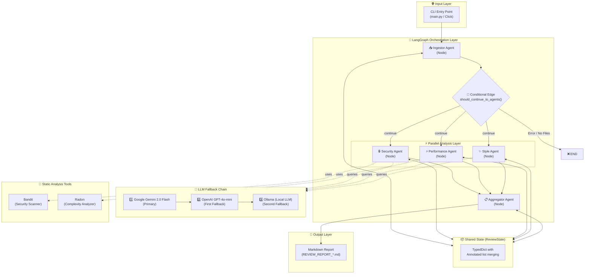
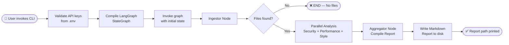
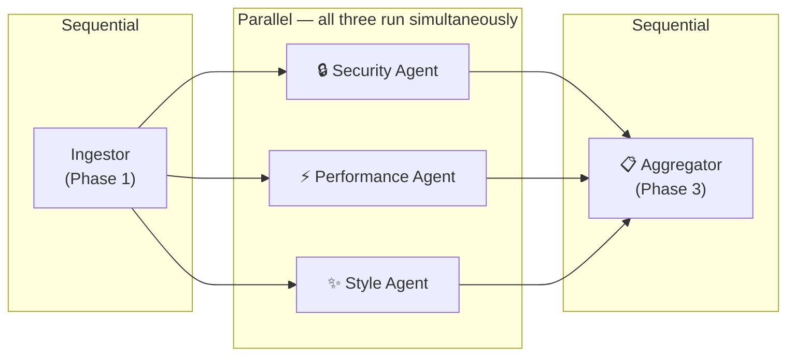
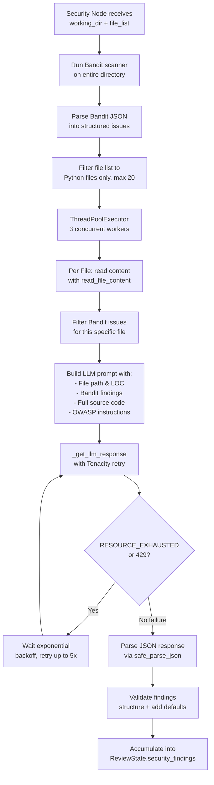
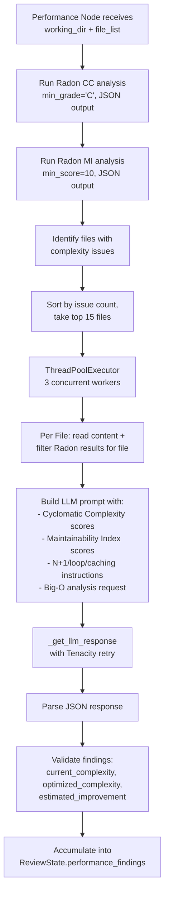
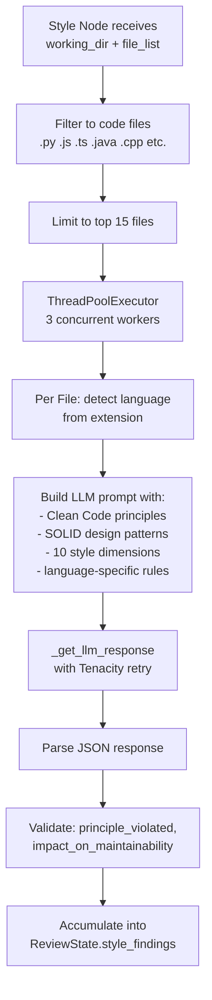
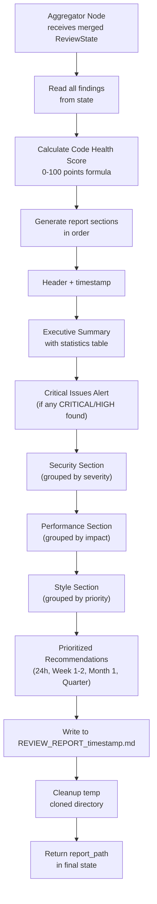
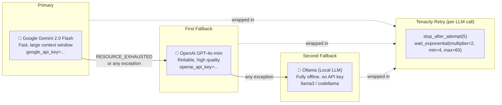

# Automated Code Review Agent
### A multi-agent system for automated code analysis

[](https://python.org)
[](https://langchain-ai.github.io/langgraph/)
[](https://langchain.com)
[](https://ai.google.dev)
[](https://opensource.org/licenses/MIT)

---

## 📋 Table of Contents

1. [Project Overview](#1-project-overview)
2. [Architecture Overview](#2-architecture-overview)
3. [Technology Stack](#3-technology-stack)
4. [Agentic Design Philosophy](#4-agentic-design-philosophy)
5. [System Workflow & Methodology](#5-system-workflow--methodology)
6. [Agent Deep-Dive](#6-agent-deep-dive)
7. [LLM Fallback Chain](#7-llm-fallback-chain)
8. [State Management](#8-state-management)
9. [Static Analysis Tools](#9-static-analysis-tools)
10. [Output & Reporting](#10-output--reporting)
11. [Project Structure](#11-project-structure)
12. [Setup & Installation](#12-setup--installation)
13. [Configuration Reference](#13-configuration-reference)
14. [Usage](#14-usage)
15. [Extending the System](#15-extending-the-system)

---

## 1. Project Overview

This tool runs automated code analysis on a codebase — either a local directory or a GitHub repository URL — and generates a Markdown report covering security vulnerabilities, performance issues, and code style problems.

It uses a **multi-agent architecture** built with LangGraph, where separate agents handle ingestion, security analysis, performance analysis, style analysis, and report generation. Each agent runs as a node in a directed graph, communicating through a shared typed state.

The analysis combines two approaches:
- **Static analysis tools** (Bandit for security, Radon for complexity) — fast and deterministic.
- **LLM reasoning** (Gemini, OpenAI, or Ollama) — used to interpret tool output, validate findings, and generate contextual recommendations.

The LLMs are not always right and can miss things. The static tools are included specifically because they are faster and more reliable for well-known patterns.

---

## 2. Architecture Overview


```mermaid
flowchart TB
    subgraph INPUT["🌐 Input Layer"]
        CLI["CLI Entry Point\n(main.py / Click)"]
    end

    subgraph GRAPH["🔗 LangGraph Orchestration Layer"]
        direction TB
        INGESTOR["📥 Ingestor Agent\n(Node)"]
        COND{"🔀 Conditional Edge\nshould_continue_to_agents()"}
        
        subgraph PARALLEL["⚡ Parallel Analysis Layer"]
            direction LR
            SEC["🔒 Security Agent\n(Node)"]
            PERF["⚡ Performance Agent\n(Node)"]
            STYLE["✨ Style Agent\n(Node)"]
        end

        AGG["📋 Aggregator Agent\n(Node)"]
    end

    subgraph LLM_LAYER["🧠 LLM Fallback Chain"]
        GEMINI["1️⃣ Google Gemini 2.0 Flash\n(Primary)"]
        OPENAI["2️⃣ OpenAI GPT-4o-mini\n(First Fallback)"]
        OLLAMA["3️⃣ Ollama (Local LLM)\n(Second Fallback)"]
        GEMINI --> OPENAI --> OLLAMA
    end

    subgraph TOOLS["🔧 Static Analysis Tools"]
        BANDIT["Bandit\n(Security Scanner)"]
        RADON["Radon\n(Complexity Analyzer)"]
    end

    subgraph STATE["📦 Shared State (ReviewState)"]
        SSTATE["TypedDict with\nAnnotated list merging"]
    end

    subgraph OUTPUT["📄 Output Layer"]
        REPORT["Markdown Report\n(REVIEW_REPORT_*.md)"]
    end

    CLI --> INGESTOR
    INGESTOR --> COND
    COND -- "Error / No Files" --> END_ERR["❌ END"]
    COND -- "continue" --> SEC & PERF & STYLE
    SEC & PERF & STYLE --> AGG
    AGG --> REPORT

    SEC -. "uses" .-> BANDIT
    SEC -. "queries" .-> LLM_LAYER
    PERF -. "uses" .-> RADON
    PERF -. "queries" .-> LLM_LAYER
    STYLE -. "queries" .-> LLM_LAYER

    INGESTOR & SEC & PERF & STYLE & AGG <--> STATE
```

---

## 3. Technology Stack

### Core Orchestration

| Library | Version | Purpose & Why It Was Chosen |
|---|---|---|
| **LangGraph** | `>=0.2.0` | Orchestrates the multi-agent workflow as a directed, stateful graph. Used because it natively supports parallel node execution, conditional edges, and typed shared state — which maps well to this project's structure. |
| **LangChain** | `>=0.3.0` | Provides abstractions for LLM interaction (messages, prompts, model interfaces), making it straightforward to swap LLM backends. |
| **langchain-core** | `>=0.3.0` | Low-level interfaces (`BaseChatModel`, `SystemMessage`, `HumanMessage`) shared across all three LLM providers. |

### LLM Providers

| Library | Version | Provider | Role |
|---|---|---|---|
| **langchain-google-genai** | `>=2.0.0` | Google Gemini | **Primary LLM** — Gemini 2.0 Flash is the default. It has a reasonably large context window and handles code well enough for this use case. |
| **langchain-openai** | `>=0.2.0` | OpenAI GPT | **First Fallback** — GPT-4o-mini is used if Gemini hits a quota error or is unavailable. |
| **langchain-ollama** | `>=0.1.0` | Ollama (Local) | **Second Fallback** — Runs a local model (e.g. llama3, codellama) if both cloud providers fail. Useful when you have no API credits or need to work offline. Quality will vary depending on the model. |

### Static Analysis Tools

| Library | Version | Purpose & Why It Was Chosen |
|---|---|---|
| **Bandit** | `>=1.7.5` | Python security linter. Performs AST analysis and outputs findings mapped to CWE IDs and OWASP categories. Used because its structured JSON output can be fed directly into LLM prompts as context. |
| **Radon** | `>=6.0.1` | Measures Cyclomatic Complexity (CC) and Maintainability Index (MI) per file and function. Gives the LLM numeric context rather than asking it to guess complexity from scratch. |
| **Pylint** | `>=3.0.0` | General Python linting for style and quality checks. |

### Code Ingestion

| Library | Version | Purpose |
|---|---|---|
| **GitPython** | `>=3.1.40` | Used to clone Git repositories programmatically from a URL, without shelling out to `git` directly. |
| **pathspec** | `>=0.12.0` | Parses `.gitignore` patterns so the file scanner skips excluded directories like `node_modules`, `__pycache__`, etc. |

### CLI & Utilities

| Library | Version | Purpose |
|---|---|---|
| **Click** | `>=8.1.7` | Declarative CLI framework providing `--path`, `--output`, `--model` flags with type checking, help text, and validation. |
| **python-dotenv** | `>=1.0.0` | `.env` file loading for secure API key management without hard-coding credentials. |
| **Pydantic** | `>=2.5.0` | Data validation for structured findings (TypedDict definitions). |
| **Tenacity** | `>=8.2.3` | Declarative retry logic with **exponential backoff**. Applied to all LLM calls to gracefully handle `429 RESOURCE_EXHAUSTED` (rate limit) errors without crashing. |
| **Rich** | `>=13.7.0` | Terminal output formatting. |
| **Colorama** | `>=0.4.6` | Cross-platform terminal color support. |

---

## 4. Agentic Design Decisions

### 4.1 One Agent per Concern
Each agent has a single responsibility: the Ingestor fetches code, the Security agent checks security, etc. No agent touches another's results. This makes failures easier to trace and agents easier to replace or test individually.

### 4.2 Static Tool First, Then LLM
Each analysis agent runs a static tool first (Bandit or Radon), then passes the structured results to the LLM as context. The reasons:
- Static tools are fast and consistent on well-known patterns.
- LLMs are better at interpreting context, generating explanations, and catching things the static tool missed.
- Neither is reliable alone: static tools have false positives; LLMs can hallucinate line numbers or invent issues.

### 4.3 Fallback Chain for LLM Calls
Every LLM call goes through a three-tier chain (Gemini → OpenAI → Ollama) with Tenacity retry logic using exponential backoff. This handles rate limits and temporary provider issues without needing manual intervention. It does not guarantee the system will always produce good results — if all providers fail or a local model is too weak, quality will suffer.

### 4.4 Parallel Agents
The three analysis agents run in parallel via LangGraph. Within each agent, individual file analyses run concurrently using `ThreadPoolExecutor` with 3 workers. This keeps runtime reasonable for larger repos, though it does increase concurrent API usage.

### 4.5 Typed Shared State
All agents read from and write to a single `ReviewState` TypedDict. LangGraph uses `Annotated[List, operator.add]` on finding lists, so parallel agents can safely append their findings without overwriting each other.

---

## 5. System Workflow & Methodology

### 5.1 High-Level Workflow


```mermaid
flowchart LR
    A([👤 User invokes CLI]) --> B[Validate API keys\nfrom .env]
    B --> C[Compile LangGraph\nStateGraph]
    C --> D[Invoke graph\nwith initial state]
    D --> E[Ingestor Node]
    E --> F{Files found?}
    F -- No --> G([❌ END — No files])
    F -- Yes --> H[Parallel Analysis\nSecurity + Performance + Style]
    H --> I[Aggregator Node\nCompile Report]
    I --> J[Write Markdown\nReport to disk]
    J --> K([✅ Report path printed])
```

### 5.2 Phase 1 — Code Ingestion

```mermaid
flowchart TD
    A[Ingestor Node receives\ninput_path from state] --> B{Is input_path\na Git URL?}
    
    B -- Yes --> C[GitPython clones\nrepository to temp dir]
    C --> D[Mark is_temp=True\nfor cleanup later]
    
    B -- No --> E[Resolve local path\nusing pathlib]
    E --> F[Mark is_temp=False]
    
    D & F --> G[scan_local_directory\nwith pathspec .gitignore support]
    G --> H[Filter by extension\nand file size ≤ 5MB]
    H --> I[Build file_tree dict\n{files, total_files, extensions}]
    I --> J[Write file_tree, working_dir,\nsource_type to ReviewState]
    J --> K{total_files > 0?}
    K -- No --> L[Return END edge]
    K -- Yes --> M[Return 'continue' edge\nto parallel agents]
```

**Key Implementation Details:**
- URL detection uses regex (`is_git_url()`) matching `http(s)://...` and `git@...` patterns.
- Temporary directories created during Git cloning are tracked in `IngestorAgent.temp_directories` and cleaned up by the Aggregator node after all agents finish — not in the Ingestor itself, ensuring cloned files remain accessible during analysis.
- The file scanner respects `.gitignore` patterns via `pathspec` and applies configurable extensions filtering.

### 5.3 Phase 2 — Parallel Agentic Analysis

The conditional edge after the Ingestor routes execution to the **Security agent node**. LangGraph's edge definitions from all three agents to the Aggregator trigger the runtime to execute them concurrently:

```python
# From graph/workflow.py
workflow.add_conditional_edges("ingestor", should_continue_to_agents, {"continue": "security", END: END})
workflow.add_edge("security", "aggregator")
workflow.add_edge("performance", "aggregator")
workflow.add_edge("style", "aggregator")
```

LangGraph sees that `aggregator` has multiple incoming edges and correctly waits for **all three** to complete before executing it.


```mermaid
flowchart LR
    subgraph SEQUENTIAL["Sequential"]
        INGESTOR["Ingestor\n(Phase 1)"]
    end

    subgraph PARALLEL["Parallel — all three run simultaneously"]
        SEC["🔒 Security Agent"]
        PERF["⚡ Performance Agent"]
        STYLE["✨ Style Agent"]
    end

    subgraph SEQ2["Sequential"]
        AGG["📋 Aggregator\n(Phase 3)"]
    end

    INGESTOR --> SEC & PERF & STYLE
    SEC & PERF & STYLE --> AGG
```

### 5.4 Security Agent Methodology


```mermaid
flowchart TD
    A[Security Node receives\nworking_dir + file_list] --> B[Run Bandit scanner\non entire directory]
    B --> C[Parse Bandit JSON\ninto structured issues]
    C --> D[Filter file list to\nPython files only, max 20]
    D --> E[ThreadPoolExecutor\n3 concurrent workers]
    E --> F[Per File: read content\nwith read_file_content]
    F --> G[Filter Bandit issues\nfor this specific file]
    G --> H[Build LLM prompt with:\n- File path & LOC\n- Bandit findings\n- Full source code\n- OWASP instructions]
    H --> I[_get_llm_response\nwith Tenacity retry]
    I --> J{RESOURCE_EXHAUSTED\nor 429?}
    J -- Yes --> K[Wait exponential\nbackoff, retry up to 5x]
    J -- No failure --> L[Parse JSON response\nvia safe_parse_json]
    K --> I
    L --> M[Validate findings\nstructure + add defaults]
    M --> N[Accumulate into\nReviewState.security_findings]
```

**Security Agent Prompt Design:**
The system prompt (`prompts/security.py`) instructs the LLM to reason as a security reviewer. The user message per file includes:
1. File path and line count
2. Bandit's findings for that file (formatted)
3. The full source code
4. A fixed JSON schema the LLM must follow

The LLM is asked to assess whether each Bandit finding is a real issue or a false positive, and to flag anything Bandit missed. Results can still be noisy — especially with weaker models.

### 5.5 Performance Agent Methodology


```mermaid
flowchart TD
    A[Performance Node receives\nworking_dir + file_list] --> B[Run Radon CC analysis\nmin_grade='C', JSON output]
    B --> C[Run Radon MI analysis\nmin_score=10, JSON output]
    C --> D[Identify files with\ncomplexity issues]
    D --> E[Sort by issue count,\ntake top 15 files]
    E --> F[ThreadPoolExecutor\n3 concurrent workers]
    F --> G[Per File: read content +\nfilter Radon results for file]
    G --> H[Build LLM prompt with:\n- Cyclomatic Complexity scores\n- Maintainability Index scores\n- N+1/loop/caching instructions\n- Big-O analysis request]
    H --> I[_get_llm_response\nwith Tenacity retry]
    I --> L[Parse JSON response]
    L --> M[Validate findings:\ncurrent_complexity, optimized_complexity,\nestimated_improvement]
    M --> N[Accumulate into\nReviewState.performance_findings]
```

**Radon Metrics:**
- **Cyclomatic Complexity (CC)**: Counts the number of linearly independent paths through the code. Grade A (CC 1–5) is simple; Grade F (CC 41+) is unmaintainable.
- **Maintainability Index (MI)**: A composite score (0–100) based on Halstead volume, cyclomatic complexity, and lines of code. MI < 10 indicates very difficult-to-maintain code.

### 5.6 Style Agent Methodology


```mermaid
flowchart TD
    A[Style Node receives\nworking_dir + file_list] --> B[Filter to code files\n.py .js .ts .java .cpp etc.]
    B --> C[Limit to top 15 files]
    C --> D[ThreadPoolExecutor\n3 concurrent workers]
    D --> E[Per File: detect language\nfrom extension]
    E --> F[Build LLM prompt with:\n- Clean Code principles\n- SOLID design patterns\n- 10 style dimensions\n- language-specific rules]
    F --> G[_get_llm_response\nwith Tenacity retry]
    G --> H[Parse JSON response]
    H --> I[Validate: principle_violated,\nimpact_on_maintainability]
    I --> J[Accumulate into\nReviewState.style_findings]
```

**Style Dimensions Checked:**
1. Naming conventions (variables, functions, classes)
2. Function length (>50 lines flagged)
3. Code complexity (deeply nested logic)
4. Documentation completeness
5. DRY violations (code duplication)
6. Error handling patterns
7. Type hints completeness (Python)
8. Magic numbers and hardcoded constants
9. Dead code (unused imports, variables)
10. SOLID principle adherence

### 5.7 Phase 3 — Aggregation & Report Generation


```mermaid
flowchart TD
    A[Aggregator Node\nreceives merged ReviewState] --> B[Read all findings\nfrom state]
    B --> C[Calculate Code Health Score\n0-100 points formula]
    C --> D[Generate report sections\nin order]
    D --> E[Header + timestamp]
    E --> F[Executive Summary\nwith statistics table]
    F --> G["Critical Issues Alert\n(if any CRITICAL/HIGH found)"]
    G --> H["Security Section\n(grouped by severity)"]
    H --> I["Performance Section\n(grouped by impact)"]
    I --> J["Style Section\n(grouped by priority)"]
    J --> K["Prioritized Recommendations\n(24h, Week 1-2, Month 1, Quarter)"]
    K --> L[Write to REVIEW_REPORT_timestamp.md]
    L --> M[Cleanup temp\ncloned directory]
    M --> N[Return report_path\nin final state]
```

**Health Score Algorithm:**
```python
deductions = (
    critical_issues * 15  +
    security_high   * 10  +
    perf_high       * 8   +
    security_medium * 4   +
    perf_medium     * 3   +
    security_low    * 2   +
    style_issues    * 2
)
health_score = max(0, 100 - deductions)
```

---

## 6. Agent Deep-Dive

### 6.1 LangGraph Node Contract

Every agent in the system implements the LangGraph **node contract**: it is a Python function that accepts a `Dict` (the current `ReviewState`) and returns a `Dict` of **state updates**. LangGraph merges this partial dict into the full state using the merge rules defined on each field.

```python
def my_agent_node(state: Dict) -> Dict:
    # Read inputs
    data = state.get("some_field")
    # Do work...
    findings = analyze(data)
    # Return only the fields this agent writes
    return {"my_findings": findings}
```

This ensures agents are **composable** and **isolated** — they cannot accidentally corrupt other agents' outputs.

### 6.2 Ingestor Agent (`agents/ingestor.py`)

**Class: `IngestorAgent`**

| Method | Description |
|---|---|
| `ingest(input_path)` | Dispatcher — routes to git or local ingestion |
| `_ingest_git_repository(url)` | Clones repo via GitPython, scans with `scan_local_directory` |
| `_ingest_local_directory(path)` | Resolves and scans a local path |
| `cleanup()` | Removes temporary cloned directories |

**Why GitPython?** It provides a Python-native interface to Git, avoiding shell injection risks from `subprocess('git clone ...)` and enabling programmatic access to repository metadata.

### 6.3 Security Agent (`agents/security.py`)

**Class: `SecurityAgent`**

| Method | Description |
|---|---|
| `analyze_directory(dir, file_list)` | Runs Bandit + concurrent file analysis |
| `_analyze_file(file_path, bandit_issues)` | Builds and sends prompt for one file |
| `_get_llm_response(messages)` | LLM call with Tenacity retry + fallback |
| `_format_bandit_results(issues)` | Formats Bandit output for LLM context |
| `_parse_llm_response(response, file)` | Validates and normalizes JSON findings |

**Findings Schema:**
```json
{
  "file": "path/to/file.py",
  "line": 42,
  "severity": "HIGH",
  "confidence": "MEDIUM",
  "issue_type": "SQL_INJECTION",
  "description": "...",
  "recommendation": "...",
  "cwe_id": 89,
  "owasp_category": "A03:2021 – Injection"
}
```

### 6.4 Performance Agent (`agents/performance.py`)

**Class: `PerformanceAgent`**

| Method | Description |
|---|---|
| `analyze_directory(dir, file_list)` | Runs Radon CC + MI + concurrent file analysis |
| `_analyze_file(path, cc_issues, mi_issues)` | Builds complexity-aware prompt for one file |
| `_get_llm_response(messages)` | LLM call with retry |
| `_format_radon_results(cc, mi)` | Formats Radon output for LLM context |
| `_parse_llm_response(response, file)` | Validates and normalizes JSON findings |

**Findings Schema:**
```json
{
  "file": "path/to/file.py",
  "line": 87,
  "issue_type": "N_PLUS_ONE_QUERY",
  "description": "...",
  "complexity_score": 24.0,
  "impact": "HIGH",
  "current_complexity": "O(n²)",
  "optimized_complexity": "O(n)",
  "recommendation": "...",
  "estimated_improvement": "~70% reduction in DB calls"
}
```

### 6.5 Style Agent (`agents/style.py`)

**Class: `StyleAgent`**

| Method | Description |
|---|---|
| `analyze_directory(dir, file_list)` | Filters code files + concurrent analysis |
| `_analyze_file(file_path)` | Detects language + builds style prompt |
| `_get_llm_response(messages)` | LLM call with retry |
| `_parse_llm_response(response, file)` | Validates and normalizes JSON findings |

**Supported Languages:** Python, JavaScript, TypeScript, React (JSX/TSX), Java, C, C++, Go.

### 6.6 Aggregator Agent (`agents/aggregator.py`)

**Class: `AggregatorAgent`**

| Method | Description |
|---|---|
| `generate_report(state, output_dir)` | Orchestrates all report sections |
| `_generate_header(path, type)` | Report metadata |
| `_generate_executive_summary(...)` | Health score + statistics table |
| `_generate_critical_issues(...)` | Top critical/high findings alert |
| `_generate_security_section(findings)` | Grouped-by-severity security details |
| `_generate_performance_section(findings)` | Grouped-by-impact performance details |
| `_generate_style_section(findings)` | Grouped-by-priority style details |
| `_generate_recommendations(...)` | Time-boxed action plan |

---

## 7. LLM Fallback Chain

LLM calls use LangChain's `.with_fallbacks()` to chain three providers:


```mermaid
flowchart LR
    subgraph PRIMARY["Primary"]
        G["🤖 Google Gemini 2.0 Flash\nFast, large context window\ngoogle_api_key=..."]
    end
    subgraph FB1["First Fallback"]
        O["🤖 OpenAI GPT-4o-mini\nReliable, high quality\nopenai_api_key=..."]
    end
    subgraph FB2["Second Fallback"]
        LL["🤖 Ollama (Local LLM)\nFully offline, no API key\nllama3 / codellama"]
    end

    G -- "RESOURCE_EXHAUSTED\nor any exception" --> O
    O -- "any exception" --> LL

    subgraph RETRY["Tenacity Retry (per LLM call)"]
        R["stop_after_attempt(5)\nwait_exponential(multiplier=2, min=4, max=60)"]
    end

    PRIMARY -. "wrapped in" .-> RETRY
    FB1 -. "wrapped in" .-> RETRY
    FB2 -. "wrapped in" .-> RETRY
```

**Why this architecture?**

| Issue | Solution |
|---|---|
| Gemini `429 RESOURCE_EXHAUSTED` | Tenacity retries with exponential backoff (4s → 8s → 16s → 32s → 60s) |
| Gemini outage / quota exhausted permanently | Falls through to OpenAI GPT-4o-mini |
| OpenAI outage | Falls through to local Ollama model |
| Rate limit message too large | First line of exception only (≤200 chars) logged as a warning |

**Implementation in `utils/llm_factory.py`:**
```python
llm = ChatGoogleGenerativeAI(model=model, ...)
openai_fallback = _create_openai_llm(...)
ollama_fallback = _create_ollama_llm(...)
return llm.with_fallbacks([openai_fallback, ollama_fallback], exceptions_to_handle=(Exception,))
```

---

## 8. State Management

The entire workflow's data flows through a single **`ReviewState`** TypedDict defined in `graph/state.py`. LangGraph passes this state through every node, enabling clean agent communication without direct dependencies.

```python
class ReviewState(TypedDict):
    # Input
    input_path: str                                          # CLI --path argument
    output_dir: str                                          # CLI --output argument

    # Ingestor outputs
    file_tree: Dict                                          # Scanned file metadata
    total_files: int                                         # Total files found
    working_directory: str                                   # Local path being analyzed
    source_type: str                                         # 'git' or 'local'
    is_temp_directory: bool                                  # Whether to cleanup after

    # Agent findings — Annotated with operator.add for parallel merge
    security_findings: Annotated[List[SecurityFinding], operator.add]
    performance_findings: Annotated[List[PerformanceFinding], operator.add]
    style_findings: Annotated[List[StyleFinding], operator.add]

    # Processing tracking — also merged across parallel agents
    files_processed: Annotated[List[str], operator.add]
    files_skipped: Annotated[List[str], operator.add]

    # Final outputs
    final_report: str                                        # Markdown report content
    report_path: str                                         # Saved report file path

    # Error handling
    error: Optional[str]
    warnings: Annotated[List[str], operator.add]
```

**`Annotated[List[X], operator.add]`**: This LangGraph feature tells the runtime that when multiple parallel nodes return updates for the same list field, the lists should be **concatenated** (not overwritten). This is the key mechanism that allows the Security, Performance, and Style agents to all write to the same state safely and concurrently.

---

## 9. Static Analysis Tools

### 9.1 Bandit Security Scanner

Bandit is a Python security linter that performs AST analysis rather than simple text matching, so it understands code structure. It's widely used and integrates well here because it outputs structured JSON.

| Bandit Test | What It Detects |
|---|---|
| B101 | `assert` usage (stripped in optimized bytecode) |
| B102 | Use of `exec()` |
| B105–B107 | Hardcoded password strings |
| B201 | Flask debug mode enabled |
| B301–B303 | Unsafe pickle/marshal deserialization |
| B502–B504 | SSL/TLS misconfiguration |
| B601–B612 | Shell injection, subprocess misuse |
| B701–B703 | Template injection, YAML loading |

**Integration Pattern:** Bandit is run as a **subprocess** (not imported) to isolate its execution environment. Output is captured as JSON and parsed into a structured list, which is then injected into the LLM prompt as pre-computed context.

### 9.2 Radon Complexity Analyzer

Radon computes code complexity and maintainability metrics. These numeric scores give the LLM something concrete to reference rather than asking it to subjectively judge complexity from reading the code.

**Cyclomatic Complexity Grading:**

| Grade | CC Range | Interpretation |
|---|---|---|
| A | 1–5 | Simple, low risk |
| B | 6–10 | Well-structured |
| C | 11–20 | Slightly complex — *flagged for review* |
| D | 21–30 | More complex, refactoring recommended |
| E | 31–40 | Too complex, high risk |
| F | 41+ | Untestable, must refactor |

**Maintainability Index Interpretation:**

| MI Score | Interpretation |
|---|---|
| 100–20 | Highly maintainable |
| 19–10 | Moderately maintainable |
| 9–0 | Difficult to maintain — *flagged for review* |

---

## 10. Output & Reporting

The Aggregator produces a **structured Markdown report** saved to the `./code_reviews/` directory (configurable) with the naming convention:

```
REVIEW_REPORT_YYYY-MM-DD_HH-MM-SS.md
```

**Report Sections:**
1. **Header** — Analysis metadata (source, timestamp, analyzer)
2. **Executive Summary** — Health Score (0–100), issue counts by severity, file type distribution
3. **Critical Issues Alert** — Top CRITICAL/HIGH findings requiring immediate action
4. **Security Analysis** — Full findings grouped by CRITICAL → HIGH → MEDIUM → LOW, with CWE IDs, OWASP categories, and remediation guidance
5. **Performance Analysis** — Findings grouped by impact, with complexity before/after and estimated improvement percentage
6. **Style & Quality Analysis** — Findings grouped by priority, with violated principles and technical debt impact
7. **Prioritized Recommendations** — Four-tier action plan: 24-48 hours, Week 1-2, Month 1, Quarter 1
8. **Warnings** — Any analysis errors or skipped files
9. **Resources** — Links to OWASP, PEP8, Clean Code

---

## 11. Project Structure

```
Automated Code Review Agent/
│
├── main.py                      # CLI entry point (Click)
│
├── graph/
│   ├── workflow.py              # LangGraph StateGraph definition and compilation
│   └── state.py                 # ReviewState TypedDict + sub-typing
│
├── agents/
│   ├── ingestor.py              # Code ingestion (Git + local)
│   ├── security.py              # Security analysis agent
│   ├── performance.py           # Performance analysis agent
│   ├── style.py                 # Style & quality analysis agent
│   └── aggregator.py            # Report compilation agent
│
├── prompts/
│   ├── security.py              # System prompt for Security Agent LLM
│   ├── performance.py           # System prompt for Performance Agent LLM
│   └── style.py                 # System prompt for Style Agent LLM
│
├── tools/
│   ├── bandit_tool.py           # BanditScanner class + run_bandit_scan()
│   └── radon_tool.py            # RadonAnalyzer class + run_radon_analysis()
│
├── utils/
│   ├── llm_factory.py           # LLM provider factory + fallback chain
│   ├── llm_parser.py            # Robust JSON parsing (safe_parse_json)
│   ├── file_scanner.py          # Directory scanning + .gitignore support
│   ├── git_ops.py               # URL detection, clone, cleanup
│   └── logger.py                # Structured logging setup
│
├── .env                         # API keys and configuration (do not commit)
├── .env.template                # Template for .env setup
├── requirements.txt             # All dependencies with version pins
└── code_reviews/                # Generated review reports (output directory)
```

---

## 12. Setup & Installation

### Prerequisites
- Python 3.10 or higher
- Git
- (Optional) [Ollama](https://ollama.com) installed and running for local LLM fallback

### Step 1: Clone the Repository
```bash
git clone https://github.com/your-org/automated-code-review-agent.git
cd "Automated Code Review Agent for Software Quality"
```

### Step 2: Create a Virtual Environment
```bash
python -m venv .venv
# Windows
.venv\Scripts\activate
# macOS/Linux
source .venv/bin/activate
```

### Step 3: Install Dependencies
```bash
pip install -r requirements.txt
```

### Step 4: Configure API Keys
Copy the template and fill in your API keys:
```bash
cp .env.template .env
```

Edit `.env`:
```env
# Primary LLM Provider
LLM_PROVIDER=gemini

# Google Gemini (Primary)
GOOGLE_API_KEY=your_gemini_api_key_here
GEMINI_MODEL=gemini-2.0-flash

# OpenAI (First Fallback)
OPENAI_API_KEY=your_openai_api_key_here
OPENAI_MODEL=gpt-4o-mini

# Ollama (Second Fallback - local, no API key needed)
OLLAMA_MODEL=llama3
OLLAMA_BASE_URL=http://localhost:11434
```

### Step 5: (Optional) Pull an Ollama Model
```bash
ollama pull llama3
# Or for code-specific model:
ollama pull codellama
```

---

## 13. Configuration Reference

| Variable | Default | Description |
|---|---|---|
| `LLM_PROVIDER` | `gemini` | Primary LLM provider: `gemini` or `ollama` |
| `GOOGLE_API_KEY` | — | Google AI Studio API key |
| `GEMINI_MODEL` | `gemini-2.0-flash` | Gemini model variant |
| `OPENAI_API_KEY` | — | OpenAI API key for fallback |
| `OPENAI_MODEL` | `gpt-4o-mini` | OpenAI model for fallback |
| `OLLAMA_MODEL` | `llama3` | Ollama local model name |
| `OLLAMA_BASE_URL` | `http://localhost:11434` | Ollama server URL |
| `MAX_TOKENS_PER_REQUEST` | `100000` | LLM max output tokens |
| `TEMPERATURE` | `0.1` | LLM temperature (lower = more deterministic) |
| `MAX_RETRIES` | `3` | Maximum Tenacity retry attempts |
| `MAX_FILE_SIZE_MB` | `5` | Maximum file size to analyze |
| `OUTPUT_DIR` | `./code_reviews` | Report output directory |
| `REPORT_FORMAT` | `markdown` | Output format |
| `LOG_LEVEL` | `INFO` | Logging verbosity |
| `LOG_FILE` | `./logs/agent.log` | Log file path |

---

## 14. Usage

### Analyze a GitHub Repository
```bash
python main.py --path https://github.com/username/repository
```

### Analyze a Local Directory
```bash
python main.py --path /path/to/your/project
```

### Custom Output Directory
```bash
python main.py --path https://github.com/username/repo --output ./my_reviews
```

### Override LLM Model
```bash
python main.py --path ./my_project --model gemini-1.5-pro
```

### Example Output
```
================================================================================
🚀 Starting Automated Code Review Agent
================================================================================
📥 Starting code ingestion
🌐 Source type: Git Repository
📦 Repository: my-project
✅ Ingestion completed successfully
📊 Files ingested: 24
🔒 Security Agent: Starting security analysis
⚡ Performance Agent: Starting performance analysis
✨ Style Agent: Starting code quality analysis
🔒 Bandit found 7 potential issues
📊 Radon found 4 complexity issues
🔄 Processing 20 files concurrently with 3 workers
...
✅ Review completed successfully!
📋 Report generated: ./code_reviews/REVIEW_REPORT_2026-03-29_10-30-17.md
================================================================================
```

---

## 15. Extending the System

### Adding a New Analysis Agent

1. **Create the agent class** in `agents/new_agent.py` with a `create_new_agent_node()` function.
2. **Add the findings type** to `graph/state.py`:
   ```python
   new_findings: Annotated[List[NewFinding], operator.add]
   ```
3. **Register the node** in `graph/workflow.py`:
   ```python
   workflow.add_node("new_agent", create_new_agent_node())
   workflow.add_edge("new_agent", "aggregator")
   ```
4. **Handle findings** in `agents/aggregator.py`.

### Adding a New LLM Provider

Add a new `_create_<provider>_llm()` function in `utils/llm_factory.py` and insert it into the `.with_fallbacks()` list.

### Adding a New Static Analysis Tool

Create a wrapper class in `tools/new_tool.py` following the `BanditScanner`/`RadonAnalyzer` pattern (subprocess execution, JSON output, structured parsing) and integrate it into the relevant agent's `analyze_directory()` method.

---

## 📜 License

This project is licensed under the MIT License. See `LICENSE` for details.

## 🤝 Contributing

Pull requests are welcome. For major changes, please open an issue first to discuss what you would like to change.

---

> **Built with** 🧠 LangGraph · Google Gemini · OpenAI GPT · Ollama · Bandit · Radon
