# 🔍 Automated Code Review Agent

A production-ready Multi-Agent System (MAS) built with LangGraph for comprehensive automated code review. This system analyzes codebases from local directories or GitHub repositories, leveraging static analysis tools and Large Language Models (LLMs) to generate detailed reports on security, performance, and code style.

## 🌟 Key Features

- **Multi-Provider LLM Support**: Seamlessly switch between Google Gemini (Cloud) and Ollama (Local) models.
- **Parallel Agent Execution**: Utilizes LangGraph for concurrent execution of specialized analysis agents.
- **Deep Static Analysis**: Integrates Bandit for security scanning and Radon for complexity metrics.
- **Intelligent Reporting**: Generates actionable, structured markdown reports with prioritized findings.
- **Robustness**: Handles large repositories, respects `.gitignore`, and includes retry mechanisms for API reliability.
- **Secure by Design**: API keys and secrets are managed via environment variables.

---

## 🏗️ System Architecture

The system employs a graph-based architecture orchestrated by LangGraph. Each node in the graph represents a specialized agent or processing step.

```mermaid
graph TD
    Start([🚀 Start]) --> Ingest[📥 Ingestor Agent]
    Ingest -->|Files & Metadata| Parallel{⚡ Parallel Analysis}
    
    subgraph Analysis Phase
        Parallel --> Security[🔐 Security Agent]
        Parallel --> Performance[⚡ Performance Agent]
        Parallel --> Style[✨ Style Agent]
    end
    
    Security -->|Findings| Aggregator[📋 Aggregator Agent]
    Performance -->|Findings| Aggregator
    Style -->|Findings| Aggregator
    
    Aggregator -->|Report Generation| End([✅ Final Report])
```



### 🧠 Agent Roles

| Agent | Responsibility | Tools Used |
|-------|----------------|------------|
| **Ingestor** | Clones repos, scans directories, respects `.gitignore`. | Git, `pathspec` |
| **Security** | Identifies vulnerabilities (SQLi, XSS, secrets). | Bandit, LLM Analysis |
| **Performance** | Detects inefficiencies, N+1 queries, complexity. | Radon, LLM Analysis |
| **Style** | Enforces Clean Code principles, SOLID patterns. | LLM Analysis |
| **Aggregator** | Compiles findings, calculates health scores, generates report. | Jinja2 (Templates) |

---

## 🛠️ Technology Stack & Design Decisions

### **Core Framework: LangGraph & LangChain**
- **Why?**: LangGraph provides superior control over agent workflows compared to linear chains. It allows for cyclic graphs, state persistence, and parallel execution, which is crucial for analyzing multiple aspects of code simultaneously.
- **State Management**: Using `TypedDict` state ensures type safety and clear data flow between agents.

### **LLM Providers: Google Gemini & Ollama**
- **Google Gemini (1.5 Pro/Flash)**: Chosen for its large context window (up to 2M tokens) and high reasoning capabilities, making it ideal for analyzing entire file contents.
- **Ollama (Llama 3.2)**: Integrated for privacy-conscious users who prefer local inference. Useful for analyzing sensitive code without sending data to the cloud.

### **Static Analysis: Bandit & Radon**
- **Bandit**: Provides a solid baseline for security scanning in Python, identifying common vulnerabilities before the LLM even sees the code.
- **Radon**: Calculates Cyclomatic Complexity (CC) and Maintainability Index (MI), giving the Performance Agent objective metrics to base its recommendations on.

### **Utilities**
- **Tenacity**: Implements exponential backoff for API calls, ensuring system stability during rate limiting.
- **Pydantic**: Used for robust data validation and settings management.

---

## � Setup & Installation

### Prerequisites
- **Python 3.10+**
- **Git** (for repository cloning)
- **Google Gemini API Key** (if using Gemini)
- **Ollama** (if using local models)

### 1. Clone the Repository
```bash
git clone https://github.com/yourusername/automated-code-review-agent.git
cd "Automated Code Review Agent for Software Quality"
```

### 2. Create Virtual Environment
```bash
python -m venv venv
# Windows
venv\Scripts\activate
# Linux/macOS
source venv/bin/activate
```

### 3. Install Dependencies
```bash
pip install -r requirements.txt
```

### 4. Configure Environment
Copy the template and edit your `.env` file:
```bash
cp .env.template .env
```

#### For Google Gemini:
```env
LLM_PROVIDER=gemini
GOOGLE_API_KEY=your_api_key_here
GEMINI_MODEL=gemini-1.5-flash
```

#### For Ollama (Local):
```env
LLM_PROVIDER=ollama
OLLAMA_BASE_URL=http://localhost:11434
OLLAMA_MODEL=llama3.2
```

---

## 💻 Usage Guide

The application is run via the `main.py` CLI. It supports various input sources and configuration options.

### Basic Analysis
Review a local project directory:
```bash
python main.py --path ./my_project
```

Review a public GitHub repository:
```bash
python main.py --path https://github.com/fastapi/fastapi
```

### Advanced Options

| Flag | Description | Example |
|------|-------------|---------|
| `--path` | Path to local dir or GitHub URL | `--path ./src` |
| `--output` | Directory for the final report | `--output ./reports` |
| `--model` | Override the model defined in .env | `--model gemini-1.5-pro` |
| `--exclude` | Patterns to exclude from analysis | `--exclude "*.test.py,v1/*"` |

### Example Output
```text
INFO | 🚀 Starting Automated Code Review Agent
INFO | 🤖 Using Ollama as LLM provider
INFO | 🔍 Analyzing: ./test_project
...
INFO | 🔐 Security Node: Analysis complete
INFO | ⚡ Performance Node: Analysis complete
INFO | ✨ Style Node: Analysis complete
INFO | 📋 Aggregator Node: Report generated
INFO | ✅ Report saved to: ./code_reviews/REVIEW_REPORT_2024-03-20.md
```

---

## 📊 Report Structure

The generated markdown report includes:

1.  **Executive Summary**: Code health score (0-100), critical issue count, and file statistics.
2.  **Critical Issues**: High-severity vulnerabilities requiring immediate attention.
3.  **Detailed Findings**: Broken down by Security, Performance, and Style, including:
    -   File & Line Number
    -   Issue Description
    -   **AI-Powered Recommendation** (with code examples)
4.  **Action Plan**: Prioritized list of tasks for the development team (Immediate, Short-term, Long-term).

---

## 🤝 Contributing

We welcome contributions! Please follow these steps:

1.  Fork the repository.
2.  Create a feature branch (`git checkout -b feature/amazing-feature`).
3.  Commit your changes (`git commit -m 'Add amazing feature'`).
4.  Push to the branch (`git push origin feature/amazing-feature`).
5.  Open a Pull Request.

## � License

Distributed under the MIT License. See `LICENSE` for more information.


PS D:\SAMI\AgenticAI\Automated Code Review Agent for Software Quality> .venv\Scripts\python.exe main.py --path https://github.com/SAMI-CODEAI/SalesVisionLR.git